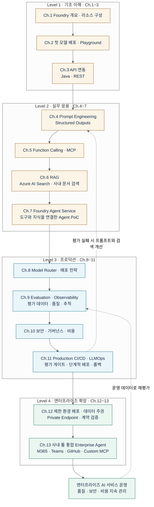

# Microsoft Foundry 실무 커리큘럼

> 📢 **명명 변경 안내 (2026-06)** — Microsoft가 **"Azure AI Foundry" → "Microsoft Foundry"** 로 리브랜딩했습니다.
> 포털 URL(**https://ai.azure.com**)은 그대로이고 기존 리소스도 그대로 동작합니다. 본 커리큘럼은 새 명명을 사용합니다.
> 검색·문서 링크에서 "Azure AI Foundry" 표기를 여전히 볼 수 있는데, 대부분 동일 서비스를 가리킵니다.

Microsoft Foundry(구 Azure AI Foundry)를 **처음 만지는 사람부터 프로덕션 배포까지** 이어지는 실무 심화 교재.
챕터당 5~10페이지, **개념 → 실습 코드 → 함정/베스트 프랙티스** 3단 구조.

## 전체 교육 flow

**첫 모델 호출 → RAG·Agent PoC → 프로덕션 LLMOps → 엔터프라이즈 확장**의 4단계로 구성됩니다.
실선은 권장 학습 순서이며, 점선은 운영 중 품질 문제가 발견됐을 때 되돌아가는 개선 흐름입니다.

| 학습 구간 | 다음 단계에 전달하는 결과 |
|---|---|
| Ch.1~3 | 배포된 모델과 Java·REST API 연동 |
| Ch.4~7 | 프롬프트·검색·도구를 연결한 RAG 챗봇 또는 Agent PoC |
| Ch.8~11 | 평가·관측·거버넌스와 CI/CD를 갖춘 프로덕션 운영 체계 |
| Ch.12~13 | 제한 환경 배포 설계와 사내 시스템 통합 Agent |

챕터별 문서: [커리큘럼](#커리큘럼) · 운영 반복 실습: [Ch.11 Production CI/CD & LLMOps](Ch11_LLMOps.md)

---

## 대상 독자

- Azure OpenAI / Azure ML 경험이 없거나 얕은 개발자
- Foundry 기반 GenAI 서비스 실무 담당자 (백엔드 / 플랫폼)
- MLOps · DevOps · 보안/거버넌스 담당자
- 사내 PoC → 프로덕션 이관을 준비 중인 팀

## 학습 방식

- **주 언어: Java 21 LTS + Azure SDK for Java** (Maven 기준)
- **부 언어: REST curl** — SDK가 없는 환경/디버깅용
- **Ch.9 Evaluation은 Python 병기** — Foundry Evaluation SDK가 Python 우선이라 어쩔 수 없음. 챕터 서두에 명시.
- 각 챕터는 앞 챕터를 전제로 함. 순서대로 읽는 것을 권장.

## Java SDK 스택 결정 (중요)

| 용도 | 패키지 | 상태 | 버전 |
|---|---|---|---|
| **Foundry 통합** | `com.azure:azure-ai-projects` | ✅ **GA** | 2.1.0 |
| **Agents** | `com.azure:azure-ai-agents` | ✅ GA | 2.1.0 |
| **Content Safety** | `com.azure:azure-ai-contentsafety` | ✅ GA | 1.0.18 |
| **AI Search (RAG)** | `com.azure:azure-search-documents` | ✅ GA | 12.0.0 |
| **Entra ID 인증** | `com.azure:azure-identity` | ✅ GA | 1.18.4 |
| **OpenAI Chat** | `com.azure:azure-ai-openai` | ⚠️ **BETA** | 1.0.0-beta.16 |
| **AI Inference (unified)** | `com.azure:azure-ai-inference` | ⚠️ BETA | 1.0.0-beta.5 |
| **Persistent Agents** | `com.azure:azure-ai-agents-persistent` | ⚠️ BETA | 1.0.0-beta.2 |
| **오케스트레이션 (권장)** | `dev.langchain4j:langchain4j-azure-open-ai` | ✅ GA | 1.17.0 |
| **Spring 프로젝트** | `org.springframework.ai:spring-ai-openai-sdk` | ✅ GA | 2.0.0+ |
| **Semantic Kernel Java** | ~~`com.microsoft.semantic-kernel`~~ | 🚫 **유지보수 모드** | — |

> ⚠️ **`azure-ai-openai`는 아직 GA가 없습니다** (2026-07 기준). 그래서 이 커리큘럼은 **Azure AI Projects + LangChain4j** 를 주 스택으로 잡고, `azure-ai-openai-beta` 는 특정 저수준 기능(오디오·이미지 생성 등)에서만 사용합니다. Semantic Kernel Java는 유지보수 모드라 신규 프로젝트에는 권장하지 않습니다.

### Java SDK 결손 부분 (Python 병기 필요)

- **Evaluation SDK**: Java 패키지 없음 → REST API 또는 OpenAI SDK 래퍼 사용. **Ch.9는 Python 병기**.
- **Prompt Flow**: Java 지원 없음 → REST API만.
- **Tracing/Observability**: 제한적 (`azure-core-tracing-opentelemetry` beta) → OpenTelemetry 수동 계측 권장.

## 실습 환경 준비물

| 항목 | 버전 / 요구사항 |
|---|---|
| JDK | 21 LTS 이상 (Adoptium Temurin 권장) |
| 빌드 도구 | Maven 3.9+ 또는 Gradle 8+ |
| IDE | IntelliJ IDEA / VS Code + Extension Pack for Java |
| Azure 구독 | Free tier 가능. Foundry 리소스 배포 권한 필요 |
| Azure CLI | 2.60+ (`az login` 인증용) |
| Python (Ch.9만) | 3.11+ |
| Git | 최신 |

Foundry 리소스 만드는 법은 **Ch.1** 참조.

---

## 커리큘럼

### 🟢 초급 (Beginner) — 기초 이해

| Ch | 제목 | 파일 | 상태 |
|---|---|---|---|
| 1 | Microsoft Foundry 개요 & 시작 | [Ch01_Foundry_Overview.md](Ch01_Foundry_Overview.md) | ✅ 완료 |
| 2 | 첫 모델 배포와 Playground (GPT-5/5.5 · Claude · Llama · Phi) | [Ch02_First_Deployment.md](Ch02_First_Deployment.md) | ✅ 완료 |
| 3 | API 연동 기초 (Java + REST) | [Ch03_API_Basics.md](Ch03_API_Basics.md) | ✅ 완료 |

### 🟡 중급 (Intermediate) — 실무 응용

| Ch | 제목 | 파일 | 상태 |
|---|---|---|---|
| 4 | Prompt Engineering & Structured Outputs | [Ch04_Prompt_Engineering.md](Ch04_Prompt_Engineering.md) | ✅ 완료 |
| 5 | Function Calling & Tool Use (**MCP GA**) | [Ch05_Function_Calling.md](Ch05_Function_Calling.md) | ✅ 완료 |
| 6 | RAG — Azure AI Search 연동 | [Ch06_RAG_AI_Search.md](Ch06_RAG_AI_Search.md) | ✅ 완료 |
| 7 | Foundry Agent Service (**Responses API v2**) | [Ch07_Agent_Service.md](Ch07_Agent_Service.md) | ✅ 완료 |

### 🔴 고급 (Advanced) — 프로덕션

| Ch | 제목 | 파일 | 상태 |
|---|---|---|---|
| 8 | Model Router & 배포 전략 | [Ch08_Model_Router.md](Ch08_Model_Router.md) | ✅ 완료 |
| 9 | Evaluation & Observability (Python 병기) | [Ch09_Evaluation.md](Ch09_Evaluation.md) | ✅ 완료 |
| 10 | 보안 · 거버넌스 · 비용 (Foundry Control Plane) | [Ch10_Security_Governance.md](Ch10_Security_Governance.md) | ✅ 완료 |
| 11 | Production CI/CD & LLMOps | [Ch11_LLMOps.md](Ch11_LLMOps.md) | ✅ 완료 |

### 🟣 엔터프라이즈 확장 (Enterprise Extension) — 폐쇄망 · 사내 툴 통합

| Ch | 제목 | 파일 | 상태 |
|---|---|---|---|
| 12 | 폐쇄망 근접 배포 · 데이터 주권 · MS 계약 검증 (ZDR / CCC / Private Endpoint) | [Ch12_Enterprise_Deployment.md](Ch12_Enterprise_Deployment.md) | ✅ 완료 |
| 13 | 사내 툴 통합 Enterprise Agent 실전 (M365 · Teams · Outlook · GitHub · Slack · Custom MCP) | [Ch13_Enterprise_Agent_Integration.md](Ch13_Enterprise_Agent_Integration.md) | ✅ 완료 |

---

## 📌 2026 주요 변경 반영 사항

본 커리큘럼은 다음 최신 변경사항을 반영합니다 (2026-07 기준):

| 영역 | 변경 내용 | 영향 챕터 |
|---|---|---|
| **명명** | Azure AI Foundry → **Microsoft Foundry** (2026-06) | 전체 |
| **Agent API** | Assistants API → **Responses API v2** (Threads/Messages/Runs → Conversations/Items/Responses) | Ch.7, Ch.8 |
| **리소스 모델** | Hub-based Project (legacy) → **Foundry Project** (권장) | Ch.1 |
| **모델 카탈로그** | GPT-5.5 (2026-04), **Claude in Foundry** (2026-06), Sora-2, Grok 등 파트너 모델 확장 | Ch.2 |
| **MCP** | Agent Service의 **MCP 통합 GA** (원격 MCP 서버 + Foundry MCP Server preview) | Ch.5, Ch.7, Ch.13 |
| **배포 유형** | Global Standard / Global Provisioned / Global Batch / Data Zone / Regional / Developer | Ch.2, Ch.8 |
| **평가·관측** | Continuous Evaluation GA, Trace Replay preview, **AI Red Teaming Agent** preview | Ch.9 |
| **거버넌스** | **Foundry Control Plane** GA (통합 fleet 관리, 컴플라이언스, Defender/Purview 연동) | Ch.10, Ch.12 |
| **API 버저닝** | 월별 `api-version` 파라미터 → **`/openai/v1/` stable routes** | Ch.3, Ch.7 |
| **폐쇄망 배포** | Private Endpoint + VNet Injection + Managed VNet (Allow-only-approved-outbound) 조합 GA | **Ch.12** 🆕 |
| **사내 툴 통합** | Bot Framework 프록시 · Custom MCP (Java 2.0.0 GA) · MSAL OBO 인증 · Purview DLP inline | **Ch.13** 🆕 |
| **⚠️ 정정: 유출 보상** | Customer Copyright Commitment는 IP 인덤니티이지 **데이터 유출 보상 아님**. Azure SLA는 uptime only. | **Ch.12** 🆕 |

---

## 챕터 간 연결 (Learning Path)

전체 흐름은 README 상단의 [전체 교육 flow](#전체-교육-flow)에서 확인할 수 있습니다.
아래는 학습 구간별 도달 목표입니다. Ch.12~13은 조직의 배포·통합 요구에 맞춰 심화합니다.

- **Ch.1~3**: 최소 실무 진입선. "Foundry에서 GPT-5로 뭐 하나 만들어봐" 해결.
- **Ch.4~7**: 사내 RAG 챗봇 / Responses API v2 에이전트 PoC 완결.
- **Ch.8~11**: 프로덕션 이관 · 다지역/다모델 · 평가 파이프라인 · IaC + CI/CD.
- **Ch.12~13 (Enterprise Extension)**: 폐쇄망/제한환경 배포 + 사내 툴(M365/Teams/Outlook/GitHub/Slack/ERP) 통합. **금융권·공공·엔터프라이즈 고객사용**.

## 진행 상황 (Delivery Checklist)

### 코어 커리큘럼 (Ch.1~11)
- [x] Ch.1 — Microsoft Foundry 개요 & 시작 (40.5 KB)
- [x] Ch.2 — 첫 모델 배포와 Playground (38.2 KB)
- [x] Ch.3 — API 연동 기초 (41.2 KB)
- [x] Ch.4 — Prompt Engineering & Structured Outputs (43.0 KB)
- [x] Ch.5 — Function Calling & Tool Use (MCP) (57.1 KB)
- [x] Ch.6 — RAG (Azure AI Search) (33.5 KB)
- [x] Ch.7 — Agent Service (Responses API v2) (43.1 KB)
- [x] Ch.8 — Model Router & 배포 전략 (40.1 KB)
- [x] Ch.9 — Evaluation & Observability (Python 병기) (37.5 KB)
- [x] Ch.10 — Security · Governance · Cost (34.5 KB)
- [x] Ch.11 — Production CI/CD & LLMOps (39.8 KB)

### 엔터프라이즈 확장 (Ch.12~13) 🆕
- [x] **Ch.12 — 폐쇄망 근접 배포 · 데이터 주권 · MS 계약 검증 (33.0 KB)**
- [x] **Ch.13 — 사내 툴 통합 Enterprise Agent 실전 (36.3 KB)**

**총 531 KB · 13개 챕터 전량 배포 완료 (2026-07-09 최종, v1.2)**

---

## 📝 알려진 개선 대상 (v1.2에서 revision 예정)

전체 콘텐츠는 실무 투입 가능한 수준이지만, 다음 항목은 v1.2 revision 시 손볼 예정.

| 챕터 | 이슈 | 심각도 |
|---|---|---|
| Ch.2 | 모델 버전 명세 중 "Claude 4", "Llama 4" 표현은 카탈로그 원문과 재대조 필요 (2026-07 기준 정확한 마이너 버전 표기 확인) | 낮음 |
| Ch.3 / Ch.4 | LangChain4j 1.17.0 의 `chat(String)` vs `generate(String)` 메서드 이름 최종 확인 후 통일 | 낮음 |
| Ch.6 | `text-embedding-4-preview` 은 참조 문서에 없음 → 실제 카탈로그에서 확인 후 삭제 또는 정정 | 중간 |
| Ch.6 | 검색 예제 코드의 `VectorSearchOptions` import 문 누락 | 낮음 |
| 전체 | 챕터별 하단 cross-ref 포맷 (일부는 `\|` 인라인, 일부는 개별 라인) 통일 필요 | 낮음 |

이 항목들은 콘텐츠 신뢰도에 치명타는 아니지만, 사내 배포 전 담당자가 한 번 훑어 정리하시길 권장한다.

---

## 표기 규약

- **⚠️ 함정** : 실무에서 자주 밟는 지뢰
- **💡 팁** : 알아두면 시간 절약되는 요령
- **🔧 실습** : 손으로 따라 하는 hands-on
- **📚 더 읽기** : Microsoft Learn 원문 링크
- **🔴 2026 변경** : 최근 12개월 내 바뀐 부분 (구 자료와 다름)
- 코드 블록 상단에 `// pom.xml` / `// App.java` / `# bash` 등 파일/맥락 표기

## 주요 참고 URL

| 리소스 | URL |
|---|---|
| 포털 | https://ai.azure.com |
| Docs 허브 | https://learn.microsoft.com/en-us/azure/foundry/ |
| What's New | https://learn.microsoft.com/en-us/azure/foundry/whats-new-foundry |
| 모델 카탈로그 | https://learn.microsoft.com/en-us/azure/foundry/foundry-models/ |
| Agent Service | https://learn.microsoft.com/en-us/azure/foundry/agents/overview |
| Evaluation | https://learn.microsoft.com/en-us/azure/foundry/observability/how-to/evaluate-agent |
| Content Safety | https://learn.microsoft.com/en-us/azure/ai-services/content-safety/overview |
| Control Plane | https://learn.microsoft.com/en-us/azure/foundry/control-plane/overview |
| MCP Get Started | https://learn.microsoft.com/en-us/azure/foundry/mcp/get-started |
| Java SDK 허브 | https://learn.microsoft.com/en-us/java/api/overview/azure/ |

## 버전 정보

- 커리큘럼 버전: **v1.2 (Enterprise Extension 배포판)** — Microsoft Foundry 리브랜딩 + Responses API v2 + Java SDK 실제 상태 + **Ch.12/Ch.13 엔터프라이즈 확장**
- 기준 시점: **2026-07** (Foundry / Java SDK 최신 GA 반영)
- 작성 도구: 대화형 AI 오케스트레이션 (Ch.1-11 librarian + writing 에이전트 병렬, **Ch.12-13 Sisyphus 직접 작성 + 3-축 librarian 검증**)
- 배포 완료: **2026-07-09**
- 총 분량: 13개 챕터 · ~529 KB · ~78,000 단어 (한국어)
- Ch.12-13 리서치 검증: MS Learn official + Product Terms + DPA + Trust Center 원문 인용, "contractually guaranteed" / "best effort" / "marketing claim" 3단계 라벨링
